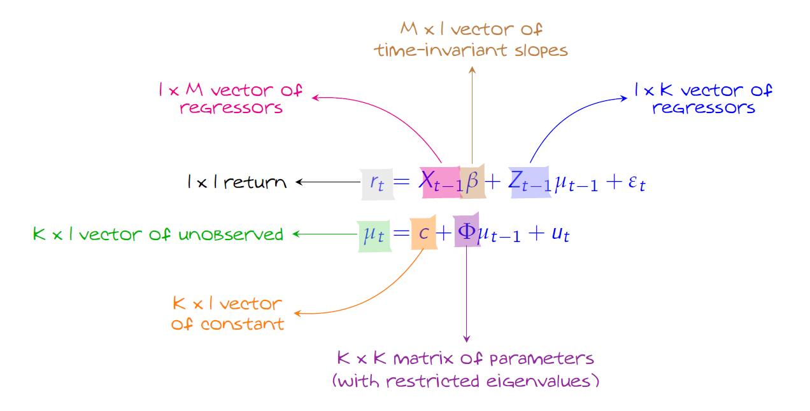

# Setup

## Working Directory

```{r, warning=FALSE, message=FALSE}
# --- confirm working directory
getwd()

# --- list existing files
list.files()
```

## Housekeeping

```{r, warning=FALSE, message=FALSE}
# --- removes all objects from the the current environment
rm(list = ls())
```

## Packages

```{r, warning=FALSE, message=FALSE}
# --- defining the packages required
packages <- c(
  "tidyverse",  # data manipulation, transformation, and visualization
  "optimx"
)

# --- from the ones needed extract the ones not installed
to_install <- packages[!packages %in% installed.packages()[, "Package"]]

# --- install the packages
if (length(to_install) > 0) {
  install.packages(to_install)
}

# --- load the packages in our session
invisible(lapply(packages, library, character.only = TRUE))
```


# Exercise 1

$$
\begin{aligned}
r_t &= \alpha + \beta x_{t-1} + \mu_{t-1} + \epsilon_t
\\
x_t &= c + \phi x_{t-1} + u_t
\\
\mu_t &= \gamma \mu_{t-1} + \eta_t
\end{aligned}
$$

## Setup
```{r, warning=FALSE, message=FALSE}
# --- set seed for reproducibility
set.seed(1234)

# --- simulation parameters

# --- observed
beta      <- 0.5
epsilon_t <- 0.2
# -- predictor
c         <- 0
phi       <- 0.9
x_0       <- c/(1-phi)
# --- unobserved
c         <- 0
gamma     <- 0.9
mu_0      <- c/(1-gamma)
# --- other
N         <- 1000
T         <- 1000

# --- initialize storage objects
r  <- matrix(0,T+N,1)
x  <- matrix(0,T+N,1)
mu <- matrix(0,T+N,1)
```

## Data Generation Process
```{r, warning=FALSE, message=FALSE}
for (t in 1:(T+N)){
  
  if (t==1){
    r[t]  <- beta%*%x_0 + mu_0 + rnorm(1,0,0.2)
    x[t]  <- c + phi%*%x_0 + rnorm(1,0,0.2)
    mu[t] <- c + gamma%*%mu_0 + rnorm(1,0,0.2)
  } 
  else{
    r[t]  <- beta%*%x[t-1] + mu[t-1] + rnorm(1,0,0.2)
    x[t]  <- c + phi%*%x[t-1] + rnorm(1,0,0.2)
    mu[t] <- c + gamma%*%mu[t-1] + rnorm(1,0,0.2) 
  }
  
}
```

## Results
```{r, warning=FALSE, message=FALSE}
# --- discard the burn-in period 
r  <- r[(N+1):(T+N)]
x  <- x[(N+1):(T+N)]
mu  <- mu[(N+1):(T+N)]

# --- build a data frame with the plotting data 
df <- data.frame(time = 1:T, mu = mu)

# --- plot the mu
ggplot(df, aes(x = time, y = mu)) +
  geom_line(color = "blue") +
  theme_minimal() +
  labs(
    x = "Time",
    y = "Predictor",
    title = "Simulated Latent Variable"
  ) +
  theme(
    axis.text  = element_text(color = "black"),
    axis.title = element_text(color = "black"),
    axis.line  = element_line(color = "black"),
    axis.ticks = element_line(color = "black"),
    plot.title = element_text(face = "bold")
  )
  
```


# Exercise 2

## Motivation

Our primary objective is to estimate the latent process $\mu_t$. However, $\mu_t$is not directly observed. It is a theoretical construct that drives the dynamics of returns, but it must be inferred from the observable data $r_t$.

To retrieve $\mu_t$, we rely on the structure imposed by the state space model. The measurement equation links the observed variable $r_t$ to the unobserved state $\mu_t$, while the state equation governs the evolution of $\mu_t$ over time. Because of this structural linkage, learning about the parameters that govern these equations allows us to learn about the latent state itself.

The key idea is the following:  
if we can determine the parameter vector $\theta$ that best explains the observed data, then we can use that parameter vector to reconstruct the path of $\mu_t$.

To determine this optimal parameter vector, we employ Maximum Likelihood Estimation (MLE). MLE selects the parameter vector $\theta$ that maximizes the probability of observing the data $r_1, \dots, r_T$ under the model.

This leads to two intertwined problems:

1. For a given parameter vector $\theta$, compute the likelihood of the observed data.
2. Search over possible parameter vectors to find the one that maximizes this likelihood.

The Kalman filter solves the first problem. The optimization routine solves the second.

---

### From the Model to the Likelihood

Given a parameter vector $\theta$, the Kalman filter recursively constructs the conditional distribution

$$
r_t \mid D_{t-1} \sim \mathcal{N}(f_t(\theta), S_t(\theta)).
$$

At each point in time:

- The prediction step forms a prior belief about the latent state $\mu_t$.
- The updating step refines that belief using the newly observed $r_t$.


Each period contributes a likelihood term:

$$
L_t(\theta) = f(r_t|D_{t-1},\theta)
$$

By the probability chain rule, the joint likelihood of the full sample is the product of these conditional densities:

$$
L(\theta) = \prod_{t=1}^T L_t(\theta) 
$$

and the total log-likelihood is obtained by summing the period contributions:

$$
\ell(r|\theta) = \log L(\theta) = \sum_{t=1}^T \ell_t(\theta).
$$

For a fixed $\theta$, this log-likelihood is just a number. It acquires meaning only when compared to the values generated by alternative parameter vectors.

---

### The Role of Optimization

The optimization routine repeatedly proposes new candidate parameter vectors $\theta$. For each candidate:

1. The Kalman filter is executed.
2. The full log-likelihood is computed.
3. The optimizer compares the resulting value to previous ones.

Through this iterative process, the algorithm searches for the parameter vector that maximizes the likelihood (equivalently, minimizes the negative log-likelihood returned by the function).

Once the optimal parameter vector $\hat{\theta}$ is found, the corresponding filtered estimates

$$
\hat{\mu}_t = b_t
$$

provide our reconstruction of the unobserved state.

Thus, the estimation of $\mu_t$is not done directly. It is obtained indirectly through:

- specifying a structural model,
- estimating its parameters via likelihood maximization,
- and applying the Kalman filter with the optimal parameters.

---

### Conceptual Summary

The workflow can therefore be summarized as:

1) Specify the state space model.
2) Use the Kalman filter to evaluate the likelihood for a given $\theta$.
3) Use MLE to find the parameter vector that best explains the data.
4) Recover the latent state using the filtered estimates associated with the optimal parameters.

In this framework, the Kalman filter translates structural assumptions into predictive distributions, while MLE selects the parameterization that makes the observed data most probable.


## 1. State Space Model

<center>{width="100%"}</center>

Let's nest our setup into the general state space such that we may derive the Kalman filter.

$$
\begin{aligned}
X_{t-1} &= 
\begin{bmatrix}
1 & x_{t-1}
\end{bmatrix} 
\\
Z_{t-1} &= 1
\\
\Phi &= \gamma
\\
\beta &= 
\begin{bmatrix}
\alpha \\
\beta
\end{bmatrix}
\end{aligned}
$$

**Measurement Equation**

$$
r_t = X_{t-1}\beta + \mu_{t-1} + \epsilon_t
$$
**State Equation**

$$
\mu_t = \Phi \mu_{t-1} + \eta_t
$$

## 2. Kalman Filter

**Prediction Equations**

$$
\begin{aligned}
\mathbb{E}(\mu_t|D_{t-1}) &: a_t = \Phi b_{t-1}\\
\mathbb{Var}(\mu_t|D_{t-1}) &: P_t = \Phi^2 Q_{t-1} + \sigma_{\eta}^2 \\
\mathbb{E}(r_t|D_{t-1}) &: f_t = X_{t-1}\beta + b_{t-1}\\
\mathbb{Var}(r_t|D_{t-1}) &: S_t = Q_{t-1} + \sigma_{\epsilon}^2 \\
\mathbb{Cov}(r_t,\mu_t|D_{t-1}) &: Gt = \Phi Q_{t-1}
\end{aligned}
$$

**Updating Equations**

$$
\begin{aligned}
\mathbb{E}(\mu_t|D_t) &: b_t = a_t + G_tS_t^{-1}(r_t-f_t)\\
\mathbb{Var}(\mu_t|D_t) &: Q_t = P_t - G_t^2S_t^{-1}
\end{aligned}
$$

**Log-Likelihood contribution at time** $t$
$$
\begin{aligned}
\ell_t(\theta) &=
\log L_t(\theta) \\
&= \log \left( \frac{1}{\sqrt{2\pi S_t}}\exp\left[-\frac{(r_t-f_t)^2}{2S_t}\right] \right) 
\\
&=\underbrace{log(1)}_{=0} - log(\sqrt{2\pi S_t}) - \frac{(r_t - f_t)^2}{2S_t} 
\\
&= -\frac{1}{2}log(2\pi) -\frac{1}{2}log(S_t) -\frac{1}{2}\frac{(r_t-f_t)^2}{S_t}
\end{aligned}
$$

```{r, warning=FALSE, message=FALSE}
kalman_like <- function(theta){
  
  # --- extract the parameters to be estimated
  alpha       <- theta[1]
  beta        <- theta[2]
  var_epsilon <- theta[3]
  phi         <- theta[4]
  var_eta     <- theta[5]
  
  T <- length(r)
  
  # --- initialize the estimates
  b_0 <- 0 
  Q_0 <- var_eta/(1-phi^2)
  
  # ---- initialize storage objects 
  L <- numeric(T)
  a <- numeric(T)
  f <- numeric(T)
  b <- numeric(T)
  P <- numeric(T)
  S <- numeric(T)
  G <- numeric(T)
  Q <- numeric(T)
  
  # --- initial values for the Kalman filter
  b[1] <- b_0
  Q[1] <- Q_0
  
  # --- Kalman Filter loop
  for (t in 2:T){
    
    # -- prediction step
    a[t] <- phi*b[t-1]
    P[t] <- (phi^2)*Q[t-1] + var_eta
    f[t] <- (alpha + x[t-1]*beta) + b[t-1]
    S[t] <- Q[t-1] + var_epsilon 
    G[t] <- phi*Q[t-1]
    
    # -- constraint St to be strictly positive 
    S[t] <- ifelse(S[t] <= 0, max(S[t], 1e-8), S[t])
    
    # -- updating step
    b[t] <- a[t] + (G[t] / S[t]) * (r[t] - f[t])
    Q[t] <- P[t] - (G[t]^2 / S[t])
    
    # -- compute the conditional log-likelihood
    L[t] <- -0.5 * log(2 * pi) - 0.5 * log(S[t]) - 0.5 * ((r[t] - f[t])^2 / S[t])
  }
  
  # --- store the estimate sglobally for further use
  assign("f_final", f, envir = .GlobalEnv)
  assign("S_final", S, envir = .GlobalEnv)
  assign("b_final", b, envir = .GlobalEnv)
  
  # --- return the negative log-likelihood for minimization
  return(-sum(L))
}
```

## 3. MLE

A brief and intuitive explanation on the mechanics of the Nelder-Mead algorithm: 

---

The Nelder–Mead algorithm is a derivative-free optimization method that searches for the parameter vector that minimizes the negative log-likelihood without requiring knowledge of the analytical form of the likelihood surface. Starting from an initial parameter guess, the algorithm constructs a simplex — a geometric object consisting of $k+1$ points in a $k$-dimensional parameter space. Each point represents a candidate parameter vector, and for each candidate the likelihood function (via the Kalman filter) is evaluated. The algorithm then ranks these points from best to worst according to their objective function values. It iteratively replaces the worst-performing parameter vector by moving the simplex through reflection, expansion, contraction, or shrinkage steps, depending on whether improvement is achieved. At each step, the likelihood function is re-evaluated to determine whether the new candidate improves the objective. This process continues until successive movements no longer produce meaningful improvements and the simplex contracts around a local minimum. Importantly, the algorithm does not know the functional shape of the likelihood surface; it navigates the parameter space using only comparisons of likelihood values, effectively searching “blindly” until convergence is reached

---

[Visualization of the Nelder-Mead algorithm](https://alexdowad.github.io/visualizing-nelder-mead/)

```{r, warning=FALSE, message=FALSE}
# --- initial guess for [alpha, beta, var_epsilon, phi, var_eta]
initial_theta <- c(0, 0, 0.01, 0.90, 0.01)

# --- solve the optimization problem
opt_result <- optimx(par = initial_theta, fn =kalman_like, method = "Nelder-Mead")

# --- extract the solution (i.e. the local maximum)
alpha_mle       <- opt_result$p1 
beta_mle        <- opt_result$p2
var_epsilon_mle <- opt_result$p3
phi_mle         <- opt_result$p4
var_eta_mle     <- opt_result$p5
```

## 4. Results
```{r, warning=FALSE, message=FALSE}
# --- build a data frame with the plotting data 
df <- data.frame(time = 1:T, true = mu, estimated = b_final)

# --- plot the mu
ggplot(df, aes(x = time)) +
  geom_line(aes(y = true, color = "True unobserved", linetype = "True unobserved")) +
  geom_line(aes(y = estimated , color = "Estimated unobserved", linetype = "Estimated unobserved")) +
  scale_color_manual(
    values = c(
      "True unobserved"  = "blue",
      "Estimated unobserved" = "red"
    ),
    guide = guide_legend(title = NULL)
  ) +
  scale_linetype_manual(
    values = c(
      "True unobserved"  = "solid",
      "Estimated unobserved" = "dashed"
    ),
    guide = guide_legend(title = NULL)
  ) +
  labs(
    x = "Time",
    y = "Predictor",
    title = NULL
  ) +
  theme_minimal() +
  theme(
    axis.text  = element_text(color = "black"),
    axis.title = element_text(color = "black"),
    axis.line  = element_line(color = "black"),
    axis.ticks = element_line(color = "black"),
    plot.title = element_text(face = "bold"),
    legend.position = c(0.30, 0.85),
    legend.justification = c(1, 0),
    legend.background = element_rect(fill = "white", color = "black")
  )
```

# Appendix

## Derivation of the Kalman Filter

This derivation follows the set-up of exercise 2.

**Initial condition** 

At time $t-1$ all we know is that we have imposed the latent variable to follow an $AR(1)$ process and from the fact that the error term is Gaussian we can infere that

$$
\mu_{t-1} | D_{t-1} \sim \mathcal{N}(b_{t-1},Q_{t-1})
$$
where $D_t = \{r_t, D_t-1\}$ is the information set available at time t.

Given we have imposed $\mu_{t-1}$ to follow an $AR(1)$, then to start off the process we can set $b_{1}$ and $Q_{1}$ to the mean and variance of the process, respectively. Following the $AR(1)$ properties we have that

$$
\begin{aligned}
b_{1} &= \mathbb{E}(\mu_{t}) = 0 
\\
Q_{1} &= \mathbb{Var}(\mu_{t}) = \frac{\sigma_{\eta}^2}{1-\Phi^2}
\end{aligned}
$$

**Prior**

At time $t$ we can write the moments of our latent variable with the information we have available up until time $t-1$.

$$
\begin{aligned}
\mathbb{E}(\mu_{t} | D_{t-1}) &= \mathbb{E}(\Phi \mu_{t-1} + \eta_t | D_{t-1}) 
\\
&= \Phi \mathbb{E}(\mu_{t-1}|D_{t-1}) + \mathbb{E}(\eta_t) &&\quad (\eta_t \text{ is independent of } D_{t-1} \text{, meaning that } \mathbb{E}(\eta_t|D_t-1) = \mathbb{E}(\eta_t))
\\
&= \underbrace{\Phi b_{t-1}}_{a_t} &&\quad (u_t \sim \mathcal{N}(0,\sigma_u^2) \Rightarrow \mathbb{E}(u_t) = 0)
\\
\mathbb{Var}(\mu_{t} | D_{t-1}) &= \mathbb{Var}(\Phi \mu_{t-1} + \eta_t | D_{t-1})
\\
&= \mathbb{Var}(\Phi \mu_{t-1}|D_{t-1}) +\mathbb{Var}(\eta_t|D_{t-1}) + 2\mathbb{Cov}(\mu_{t-1},\eta_t|D_{t-1})
\\
&= \Phi \mathbb{Var}(\mu_{t-1}|D_{t-1})\Phi' + \sigma_{\eta}^2 &&\quad (\mathbb{Cov}(\mu_{t-1},\eta_t|D_{t-1}) = 0)
\\
&= \underbrace{\Phi^2 Q_{t-1} + \sigma_{\eta}^2}_{P_t} &&\quad (\Phi \text{ is a 1x1 by vector})
\end{aligned}
$$

With the moments defined we can characterize the distribution of our latent variable conditioned on the available information 

$$
\mu_t | D_{t-1} \sim \mathcal{N}(a_t, P_t)
$$

**Prediction**

At time $t$ 

$$
\begin{aligned}
\mathbb{E}(r_t|D_{t-1}) &= \mathbb{E}(X_{t-1}\beta + \mu_{t-1} + \epsilon_t|D_{t-1}) 
\\
&= \mathbb{E}(X_{t-1}|D_{t-1})\beta + \mathbb{E}(\mu_{t-1}|D_{t-1}) &&\quad (\epsilon_t \sim \mathcal{N}(0,\sigma_{\epsilon}^2) \Rightarrow \mathbb{E}(\epsilon_t) = 0) 
\\
&= \underbrace{X_{t-1}\beta + b_{t-1}}_{f_t} &&\quad (X_{t-1} \text{ is independent of } D_{t-1} \text{ thus we can remove the expectation operator})
\\
\mathbb{Var} (r_t|D_{t-1}) &= \mathbb{Var}(X_{t-1}\beta + \mu_{t-1} + \epsilon_t |D_{t-1})
\\
&= \underbrace{\mathbb{Var}(X_{t-1}\beta|D_{t-1})}_{=0} + \mathbb{Var}(\mu_{t-1}|D_{t-1}) + \mathbb{Var}(\epsilon_t|D_{t-1}) 
\\
&+ 2\underbrace{\mathbb{Cov}(X_{t-1}\beta,\mu_{t-1}|D_{t-1})}_{=0} + 2\underbrace{\mathbb{Cov}(X_{t-1}\beta,\epsilon_t|D_{t-1})}_{=0} + 2\underbrace{\mathbb{Cov}(\mu_{t-1},\epsilon_t|D_{t-1})}_{=0}
\\ 
&= \underbrace{Q_{t-1} + \sigma_{\epsilon}^2}_{S_t}
\\
\end{aligned}
$$

With the moments defined we can characterize the distribution of the preidiction conditioned on the available information 

$$
r_t | D_{t-1} \sim \mathcal{N}(f_t, S_t)
$$

**Joint Distribution** 

$$
\begin{aligned}
\mathbb{Cov}(r_t,\mu_t|D_{t-1})
&= \mathbb{E}[(r_t - \mathbb{E}(r_t|D_{t-1}))(\mu_t - E(\mu_t|D_{t-1}))|D_{t-1}] \\
&= \mathbb{E}[(X_{t-1}\beta + \mu_{t-1} + \epsilon_t - X_{t-1}\beta - b_{t-1})(\Phi\mu_{t-1} + u_t - a_t)|D_{t-1}] \\
&= \mathbb{E}[(\mu_{t-1} + \epsilon_t - b_{t-1})(\Phi\mu_{t-1} + u_t - a_t)|D_{t-1}] \\
&= \mathbb{E}[\mu_{t-1}\Phi\mu_{t-1} + \mu_{t-1}u_t - \mu_{t-1}a_t \\
&+ \epsilon_t\Phi\mu_{t-1} + \epsilon_t u_t - \epsilon_t a_t \\
&-b_{t-1}\Phi\mu_{t-1} - b_{t-1}u_t + b_{t-1}a_t|D_{t-1}]\\
&= \mathbb{E}[\mu_{t-1}\Phi\mu_{t-1} - \mu_{t-1}a_t - b_{t-1}\Phi\mu_{t-1} + b_{t-1}a_t|D_{t-1}] \\
&= \mathbb{E}[\mu_{t-1}\Phi\mu_{t-1} - \mu_{t-1}\Phi b_{t-1} - b_{t-1}\Phi\mu_{t-1} + b_{t-1}\Phi b_{t-1}|D_{t-1}]\\
&= \mathbb{E}[\Phi\mu_{t-1}^2 - 2\Phi\mu_{t-1}b_{t-1} + \Phi b_{t-1}^2|D_{t-1}]\\
&= \Phi\mathbb{E}[(\mu_{t-1} - \mathbb{E}(\mu_{t-1}|D_{t-1}))|D_{t-1}] \\
&= \Phi\mathbb{Var}(\mu_{t-1}|D_{t-1}) \\
&= \underbrace{\Phi Q_{t-1}}_{G_t}
\end{aligned}
$$

$$
\begin{pmatrix}
r_t \\
\mu_t
\end{pmatrix}
\mid D_{t-1} 
\sim
\mathcal{N}
\begin{pmatrix}
\begin{bmatrix}
f_t\\
a_t
\end{bmatrix}
,
\begin{bmatrix}
S_t & G_t\\
G_t & P_t
\end{bmatrix}
\end{pmatrix}
$$

**Posterior**

Once we have observed $r_t$ at time $t$ we can update our information set.

With this, we can use the joint distribution to characterize the distribution of the latent variable conditioned on the newly updated information set. Thereby obtaining the posterior distribution at time $t$.

Formalizing this statement we can derive the moments 

$$
\begin{aligned}
\mathbb{E}(\mu_t|D_t) &= \mathbb{E}(\mu_t|r_t, D_{t-1}) \\
&= \underbrace{\mathbb{E}(\mu_t|D_{t-1})}_{m_2} + \underbrace{\mathbb{Cov}(\mu_t,r_t|D_{t-1})}_{V_{21}}\underbrace{\mathbb{Var}(r_t|D_{t-1})^{-1}}_{V_{11}^{-1}}(\underbrace{r_t}_{X_1}-\underbrace{\mathbb{E}(r_t|D_{t-1}}_{m_1})) \\
&= \underbrace{a_t + G_tS_t^{-1}(r_t-f_t)}_{b_t}
\\
\mathbb{Var}(\mu_t|D_t) &= \mathbb{Var}(\mu_t|r_t,D_{t-1}) \\
&= \underbrace{\mathbb{Var}(u_t|D_{t-1})}_{V_{22}} - \underbrace{\mathbb{Cov}(\mu_t,r_t|D_{t-1})}_{V_{21}}\underbrace{\mathbb{Var}(r_t|D_{t-1})^{-1}}_{V_{11}^{-1}}\underbrace{\mathbb{Cov}(r_t,\mu_t|D_{t-1})}_{V_{12}}\\
&= \underbrace{P_t - G_t^2S_t^{-1}}_{Q_t}
\end{aligned}
$$

and write the updated distribution of the latent variable 

$$
\mu_t | D_t \sim \mathcal{N}(b_t,Q_t)
$$

**Summary**

We can condense all the equations into two blocks the: (i) predictive equations - characterize the distribution of the latent variable and of the regressand at time $t$ using all the available information until then (i.e. time $t-1$); (ii) updating equations - characterize the distribution of the latent variable at time $t$ once the regressand at time $t$ has been observed 

(i) prediction equations 

$$
\begin{aligned}
\mathbb{E}(\mu_t|D_{t-1}) &: a_t = \Phi b_{t-1}\\
\mathbb{Var}(\mu_t|D_{t-1}) &: P_t = \Phi^2 Q_{t-1} + \sigma_{\eta}^2 \\
\mathbb{E}(r_t|D_{t-1}) &: f_t = X_{t-1}\beta + b_{t-1}\\
\mathbb{Var}(r_t|D_{t-1}) &: S_t = Q_{t-1} + \sigma_{\epsilon}^2 \\
\mathbb{Cov}(r_t,\mu_t|D_{t-1}) &: Gt = \Phi Q_{t-1}
\end{aligned}
$$

(ii) updating equations

$$
\begin{aligned}
\mathbb{E}(\mu_t|D_t) &: b_t = a_t + G_tS_t^{-1}(r_t-f_t)\\
\mathbb{Var}(\mu_t|D_t) &: Q_t = P_t - G_t^2S_t^{-1}
\end{aligned}
$$

**Log-Likelihood**

The Kalman filter reconstructs the latent state $\mu_t$ by exploiting the structural linkage imposed by the state space model. Given a parameter vector $\theta$, the filter recursively computes the conditional distribution of $\mu_t$ using both the state equation and the measurement equation.

Because the parameters govern the dynamics of the latent state and the magnitude of measurement noise, they determine the predictive moments of both $\mu_t$ and $r_t$. In turn, these predictive moments define the conditional distribution of the observable variable $r_t$

Remember that $r_t|D_{t-1} \sim \mathcal{N}(f_t,S_t)$, which means that we can write the density of $r_t|D_{t-1}$ as

$$
f(r_t|D_{t-1},\theta_t) = \frac{1}{\sqrt{2\pi S_t}}\exp\left[-\frac{(r_t-f_t)^2}{2S_t}\right] 
$$
with $\theta_t \equiv (\alpha, \beta, \sigma_{\epsilon}^2, \phi, \sigma_{\eta}^2)$, which characterizes both $f_t and S_t$

If we evaluate this density at the realized $r_t$, we are basically answering the question of how plausible was this observation under the model. Or, in other words, it is the likelihood contribution at time $t$.

$$
L_t(\theta) = f(r_t|D_{t-1},\theta_t)
$$

To this, we can apply a monotonic transformation by using the logarithm, which will keep the location of the maximum and get rid of the exponential function. Doing so, we obtain the log-likelihood contribution at time $t$

$$
\begin{aligned}
\ell_t(\theta) &=
\log L_t(\theta) \\
&= \log \left( \frac{1}{\sqrt{2\pi S_t}}\exp\left[-\frac{(r_t-f_t)^2}{2S_t}\right] \right) 
\\
&=\underbrace{log(1)}_{=0} - log(\sqrt{2\pi S_t}) - \frac{(r_t - f_t)^2}{2S_t} 
\\
&= -\frac{1}{2}log(2\pi) -\frac{1}{2}log(S_t) -\frac{1}{2}\frac{(r_t-f_t)^2}{S_t}
\end{aligned}
$$

Once the Kalman Filter has gone through the whole sample, we can simply sum all the log-likelihood contributions to obtain the total likelihood of observing the data. 

Formalizing this statement, let $r = (r_1, \dots, r_T)$, then density of $r$ is as follows, by following the chain rule 

$$
f(r|\theta) = f(r_1|\theta)\prod_{t=2}^T f(r_t|D_{t-1},\theta)
$$
Note that The likelihood is evaluated conditionally on the initial state. Because the recursive prediction begins at $t=2$, the first observation is treated as part of the initialization and does not contribute to the likelihood.

By the same reasoning as before, we have that 

$$
L(\theta) = f(r|\theta)
$$
Applying the logarithm

$$
\begin{aligned}
\ell(\theta) &= \log L(\theta)
\\ 
&= \log \left(\prod_{t=2}^T f(r_t|D_{t-1},\theta) \right)
\\
&= \sum_{t=2}^T \underbrace{\log f(r_t|D_{t-1}\theta)}_{\ell_t(\theta)}

\end{aligned}
$$


